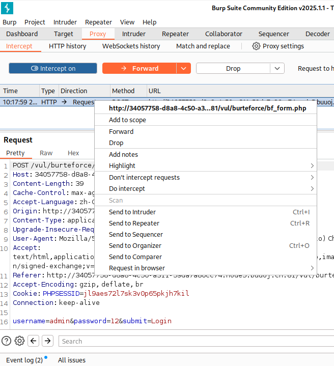
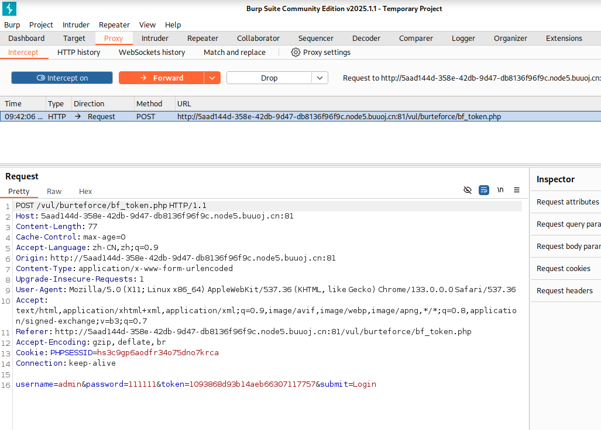

# 暴力破解概述

Burte Force（暴力破解）概述
“暴力破解”是一攻击具手段，在web攻击中，一般会使用这种手段对应用系统的认证信息进行获取。 其过程就是使用大量的认证信息在认证接口进行尝试登录，直到得到正确的结果。 为了提高效率，暴力破解一般会使用带有字典的工具来进行自动化操作。
理论上来说，大多数系统都是可以被暴力破解的，只要攻击者有足够强大的计算能力和时间，所以断定一个系统是否存在暴力破解漏洞，其条件也不是绝对的。 我们说一个web应用系统存在暴力破解漏洞，一般是指该web应用系统没有采用或者采用了比较弱的认证安全策略，导致其被暴力破解的“可能性”变的比较高。 这里的认证安全策略, 包括：
1.是否要求用户设置复杂的密码；
2.是否每次认证都使用安全的验证码（想想你买火车票时输的验证码～）或者手机otp；
3.是否对尝试登录的行为进行判断和限制（如：连续5次错误登录，进行账号锁定或IP地址锁定等）；
4.是否采用了双因素认证；
...等等。
千万不要小看暴力破解漏洞,往往这种简单粗暴的攻击方式带来的效果是超出预期的!

你可以通过“BurteForce”对应的测试栏目，来进一步的了解该漏洞。

从来没有哪个时代的黑客像今天一样热衷于猜解密码 ---奥斯特洛夫斯基

## 基于表单的暴力破解

使用burpsuite抓包得到数据

发送到intuder模块

来到intuder模块后添加需要爆破的字段

选择爆破模式

Burp Suite 中 **Intruder（入侵者）** 功能的界面，特别是攻击类型的菜单，包含了四种不同的攻击模式。以下是每种攻击模式的详细介绍：

**狙击手攻击（Sniper Attack）**：

* 这种攻击方式会将每个有效载荷（payload）逐个插入到请求中的每个位置，每次只使用一个有效载荷集。
* 它适用于测试请求中某个特定位置的漏洞，特别是在你不确定漏洞在哪个位置时。
* 这种方法逐个检查每个插入点，适合精确测试特定参数或字段。

**攻城槌攻击（Battering Ram Attack）**：

* 这种攻击方式将相同的有效载荷插入到请求中的所有位置，使用一个有效载荷集。
* 当你知道漏洞可能出现在每个位置时，这种方式比较有效。它会同时将相同的负载放入所有位置，效率较高，但不如狙击手攻击精准。

**叉形攻击（Pitchfork Attack）**：

* 这种攻击方式将不同的有效载荷集分配到请求中的每个位置。然后，Burp Suite 会并行地逐个遍历每个有效载荷集。
* 适用于当每个位置都有不同的有效载荷时，需要测试多个输入字段，并且你希望对每个字段使用不同的有效载荷。此方法可以高效地组合多个输入位置的有效载荷。

**集群炸弹攻击（Cluster Bomb Attack）**：

* 这种攻击方式为每个位置分配不同的有效载荷集，并遍历所有可能的组合。
* 适用于更复杂的测试场景，当每个位置可以有多个可能的有效载荷值，而你希望测试所有可能的组合。这种方法会非常耗时，因为它会穷举所有的有效载荷组合，但能够发现复杂的漏洞。

配置payloads选择字典文件。

根据返回长度进行排序找到特征最明显的进行查看，

得到正确的账号和密码

账号：admin

密码：123456

## 验证码绕过（on client）

登录页面增加了验证码验证，先去测试验证码是否可以重复利用，或者看源码是否是基于前端的验证并不会传到后端服务器上进行验证。

查看源码发现验证码只是在前端进行验证的

同样的可以使用burpsuite的repeater模块，通过修改参数重新请求，发现没有报验证码错误，只是提示：‘’username or password is not exists～“

由此可知可以忽略验证码，只爆破账号和密码。

同样的，和之前步骤相同添加字典爆破。

得到账号和密码：

账号：admin

密码：123456

## 验证码绕过（on server）

验证码绕过基于服务器，有些服务器后台是不刷新验证码的，所以抓到包后不要放包，这样验证码就一直有效，把包发到攻击模块直接爆破；

还有一种是验证码在服务器上短时间不会过期，或者长时间不会过期。时间足够爆破。

发送到request模块，修改参数使用相同的验证码再次发送。

发现只提示账号密码错误由此发现，验证码短期或者长期是不会过期的。

使用相同步骤进行爆破。

得到账号和密码：

账号：admin

密码：123456

## token防爆破？

发现除了账号密码字段还携带了token字段。所以每次爆破需要携带token字段进行爆破。而token每次都不同所以需要进行抓包进行获取。每次请求携带的是上次返回的token值。

这次需要使用

模块。为了降低难度，假设是知道账号的，只对密码字段进行爆破。

先配置密码字段的字典

而token字段需要抓包，需配置

添加grep-extract

配置token字段

得到账号和密码：

账号：admin

密码：123456
